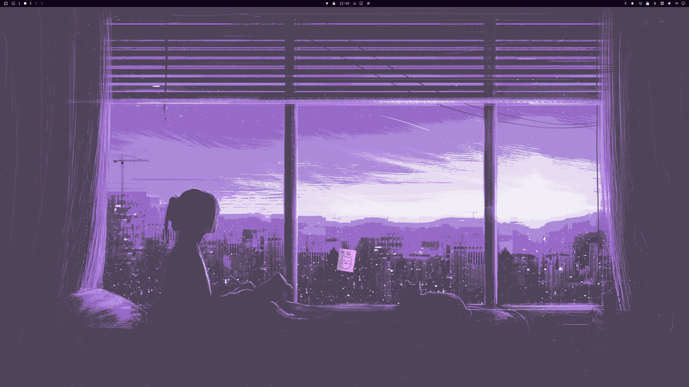

# Omarchy Zen

Syncs Omarchy's Pywal palette into Zen Browser — pure CSS, no extension, no native host. Install as an Omarchy shell plugin or standalone script. Survives Zen updates gracefully.

> **Based on [gstrand99/zen-auto-style](https://github.com/gstrand99/zen-auto-style)** by Gregory Strand (MIT). This project evolves that work into a maintained Omarchy plugin (`io.github.davidxap.omarchy-zen`) with a hardened CSS-only approach. The original extension implementation is preserved in [`legacy/`](legacy/).

## Screenshots

Zen Browser with Omarchy themes — same Pywal palette on desktop and browser, unified sidebar (gap fixed).

| Flexoki Light | Catppuccin |
|---|---|
|  |  |

> Captures with fix `3aa1045` (unified sidebar, no 1px gap). Zen `custom-zen.css` symlinked to `~/.local/state/omarchy/current/theme/custom-zen.css`. Restart Zen after `omarchy theme set`.

## Why Omarchy Zen?

- **No privileged prefs** — only `toolkit.legacyUserProfileCustomizations.stylesheets = true` (Mozilla standard). No `xpinstall.signatures.required=false`, no `extensions.experiments.enabled=true`.
- **Pure CSS bridge** — Omarchy renders `custom-zen.css.tpl` → `~/.local/state/omarchy/current/theme/custom-zen.css`, Zen reads it via symlink in `chrome/custom-zen.css`.
- **Resilient** — every `var(--custom-zen-*)` has a fallback (`#24283b`, `#7aa2f7` etc.). If Zen renames a selector, the `:root` layer still cascades.
- **Omarchy-native** — ships as a `service` plugin (`Service.qml`) that auto-runs `install.sh` on shell start. Also works standalone.

## Install

### Option A — As Omarchy plugin (recommended)

```bash
omarchy plugin add https://github.com/Davidxap/omarchy-zen.git --enable
# Service auto-runs install.sh on next shell start. Or run now:
~/.config/omarchy/plugins/io.github.davidxap.omarchy-zen/install.sh
```

Restart Zen once to load `userChrome.css`.

### Option B — Standalone

```bash
git clone https://github.com/Davidxap/omarchy-zen.git
cd omarchy-zen
./check.sh && ./install.sh
```

Both install:

- `~/.config/omarchy/themed/custom-zen.css.tpl` (Pywal template)
- `~/.config/omarchy/hooks/theme-set.d/zen-auto-style` (hook, currently no-op, reserved)
- Zen profile `chrome/zen-auto-style-chrome.css`, `zen-auto-style-content.css`, `zen-auto-style-mods.css`, `chrome/custom-zen.css` → symlink
- `user.js` pref `toolkit.legacyUserProfileCustomizations.stylesheets`

Restart Zen → `omarchy theme set <name>` → restart Zen to see new palette.

## How it works

1. Omarchy renders `custom-zen.css` from `custom-zen.css.tpl` using current palette (`~/.local/state/omarchy/current/theme/` on 4.x, fallback `~/.config/omarchy/current/theme/`).
2. Installer symlinks it into Zen's `chrome/` as `custom-zen.css`.
3. Managed `@import` blocks in `userChrome.css`/`userContent.css` load themed vars.
4. `light.mode` drives `color-scheme` appended at render time.
5. `omarchy theme refresh` regenerates stylesheet; next Zen restart picks it up via symlink.

No extension, no host, no background process.

## Optional Zen mods

| Mod | Effect |
|---|---|
| `compact-rounded-content` | 8px spacing, 10px webview corners |
| `flat-sidebar` | Removes sidebar/content shadows |
| `sidebar-splitter-hover` | Animated splitter hover |
| `unloaded-tabs` | Grayscale + transparent unloaded tabs |

```bash
./install.sh
ZEN_AUTO_STYLE_MODS=all ./install.sh
ZEN_AUTO_STYLE_MODS='sidebar-splitter-hover,unloaded-tabs' ./install.sh
```

Re-running regenerates `zen-auto-style-mods.css`.

## Requirements

- Omarchy with `omarchy` on PATH
- Zen Browser opened at least once
- Bash + `awk grep sed install mktemp`

No `python`/`zip`/`jq` needed (except `jq` for legacy reconciler cleanup).

## Plugin details

- **ID:** `io.github.davidxap.omarchy-zen`
- **Kind:** `service` → `Service.qml` (auto-installs on `Component.onCompleted` via `Quickshell.Io.Process`)
- **Validation:** `omarchy plugin validate ./` + `/usr/lib/qt6/bin/qmllint -I /usr/share/omarchy/shell Service.qml`
- Disable leaves wiring intact; explicit `./uninstall.sh` to revert (or `~/.config/omarchy/plugins/io.github.davidxap.omarchy-zen/uninstall.sh`).

## Verification

```bash
./verify.sh              # extracts omni.ja, checks #zen-* / .zen-* / --zen-* still exist
./test-fresh-install.sh  # throwaway profile in /tmp, no touch to real ~/.config/zen
```

All `var()` have fallbacks; warnings in `verify.sh` are non-fatal (cascade still provides colors).

## Uninstall

```bash
./uninstall.sh
# or via plugin dir
~/.config/omarchy/plugins/io.github.davidxap.omarchy-zen/uninstall.sh
# then
omarchy plugin remove io.github.davidxap.omarchy-zen --yes
```

Removes hook, managed imports, pref (preserving user CSS outside blocks), template if unchanged, legacy host/artifacts, ghost `zen-auto-style@omarchy.local` from `prefs.js`/`weave/addonsreconciler.json` (requires Zen closed).

## Theme switch behavior

Unlike the old XPI, CSS-only **requires a Zen restart** after `omarchy theme set`. The symlink updates instantly, but Zen only reloads `userChrome.css` on startup. This is intentional for security and update-resilience.

## Legacy

Original XPI + Python host in [`legacy/`](legacy/) — not installed, kept for reference. See `legacy/README.md`.

## Credits

- **Gregory Strand** ([gstrand99](https://github.com/gstrand99)) — original `zen-auto-style` (template, CSS, extension).
- **David Arturo Arroyave Pérez** ([Davidxap](https://github.com/Davidxap)) — Omarchy 4.x compat, CSS-only hardening, plugin packaging (`Omarchy Zen`).

## License

MIT — see [LICENSE](LICENSE). Original and fork share MIT.
