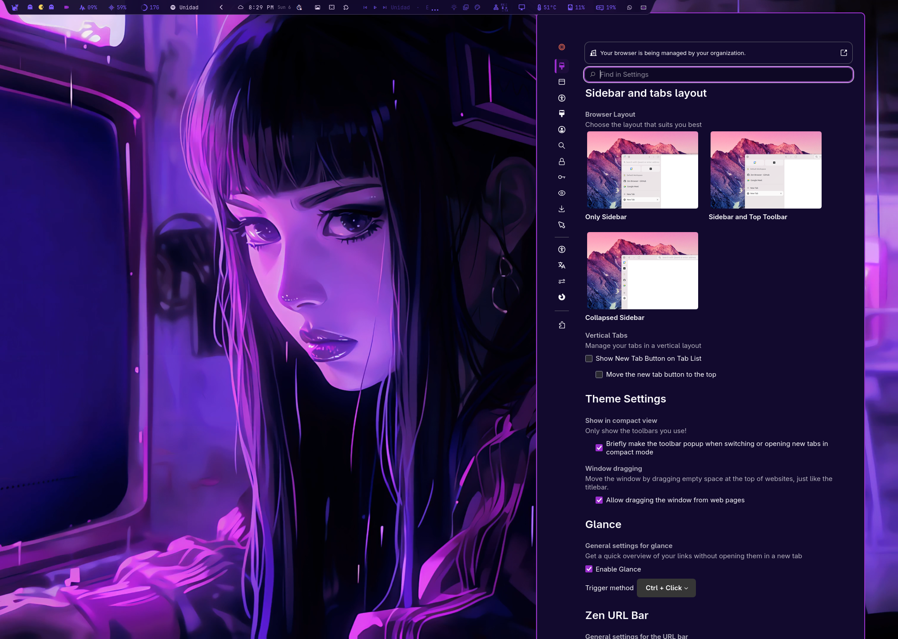
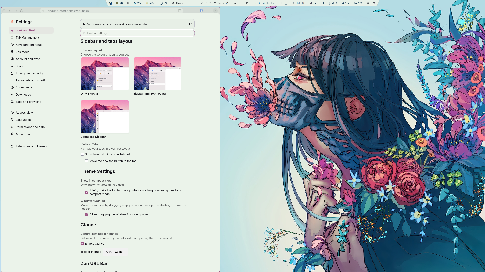
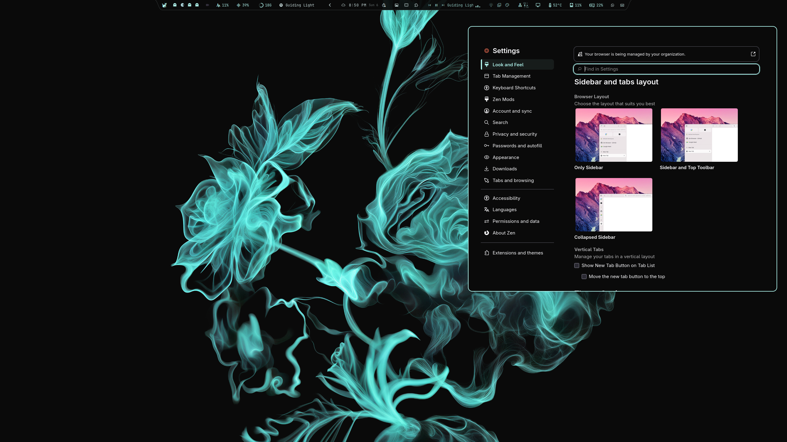

# Omarchy Zen Themes Sync

Syncs Omarchy's Pywal palette into Zen Browser — pure CSS, no extension, no native host. Install as an Omarchy shell plugin or standalone script. Survives Zen updates gracefully.

> **Based on [gstrand99/zen-auto-style](https://github.com/gstrand99/zen-auto-style)** by Gregory Strand (MIT). This project evolves that work into a maintained Omarchy plugin (`io.github.davidxap.omarchy-zen`) with a hardened CSS-only approach. The original extension implementation is preserved in [`legacy/`](legacy/).

## Screenshots

Themes used, left to right: **Osiris**, **Woman with Floral Composition**, **BlackTurq**. Osiris is available from [xElectric9177/Osiris](https://github.com/xElectric9177/Osiris); Woman with Floral Composition is found through the [omarchy-themes plugin](https://omarchyplugins.com/plugin.html?id=gotar.omarchy-themes) (install themes directly from the marketplace); BlackTurq is available from [HANCORE-linux/omarchy-blackturq-theme](https://github.com/HANCORE-linux/omarchy-blackturq-theme). The bar shown in the screenshots is the [Shibumi-Shell](https://github.com/HANCORE-linux/Shibumi-Shell) by HANCORE (a Quickshell shell for Omarchy).

| | | |
|---|---|---|
|  |  |  |


## Why Omarchy Zen?

- **No privileged prefs** — only `toolkit.legacyUserProfileCustomizations.stylesheets = true` (Mozilla standard). No `xpinstall.signatures.required=false`, no `extensions.experiments.enabled=true`.
- **Pure CSS bridge** — Omarchy renders `custom-zen.css.tpl` → `~/.local/state/omarchy/current/theme/custom-zen.css`, Zen reads it via symlink in `chrome/custom-zen.css`.
- **Resilient** — every `var(--custom-zen-*)` has a fallback (`#24283b`, `#7aa2f7` etc.). If Zen renames a selector, the `:root` layer still cascades.
- **Omarchy-native** — ships as a `service` plugin (`Service.qml`) that auto-runs `install.sh` on shell start. Also works standalone.

## Install

### Option A — As Omarchy plugin (recommended)

```bash
omarchy plugin add https://github.com/Davidxap/omarchy-zen.git --enable
# Service auto-runs install.sh on next shell start. Or run now:
~/.config/omarchy/plugins/io.github.davidxap.omarchy-zen/install.sh
```

Restart Zen once to load `userChrome.css`.

### Option B — Standalone

```bash
git clone https://github.com/Davidxap/omarchy-zen.git
cd omarchy-zen
./check.sh && ./install.sh
```

Both install:

- `~/.config/omarchy/themed/custom-zen.css.tpl` (Pywal template)
- `~/.config/omarchy/hooks/theme-set.d/zen-auto-style` (hook — re-renders the sheet from the resolved palette and posts a desktop notification when the theme changes)
- `~/.local/state/zen-auto-style/render-custom-zen.py` (deterministic renderer used by the hook and the installer fallback)
- Zen profile `chrome/zen-auto-style-chrome.css`, `zen-auto-style-content.css`, `chrome/custom-zen.css` → symlink
- `user.js` pref `toolkit.legacyUserProfileCustomizations.stylesheets`

Restart Zen → `omarchy theme set <name>` → the hook re-renders the sheet; restart Zen to see the new palette.

## How it works

1. Omarchy renders `custom-zen.css` from `custom-zen.css.tpl` using current palette (`~/.local/state/omarchy/current/theme/` on 4.x, fallback `~/.config/omarchy/current/theme/`).
2. Installer symlinks it into Zen's `chrome/` as `custom-zen.css`.
3. Managed `@import` blocks in `userChrome.css`/`userContent.css` load themed vars.
4. The `theme-set` hook re-renders the sheet deterministically from the resolved `colors.toml` (Omarchy skips template renders when the theme ships its own `custom-zen.css` or a theme switch was interrupted) and notifies with the theme name.
5. `omarchy theme refresh` regenerates the stylesheet (install wraps it in a timeout and verifies the result, re-rendering from `colors.toml` on mismatch); next Zen restart picks it up via symlink.

No extension, no host, no background process.

## Requirements

- Omarchy with `omarchy` on PATH
- Zen Browser opened at least once
- Bash + `awk grep sed install mktemp`

No `python`/`zip`/`jq` needed (except `jq` for legacy reconciler cleanup).

## Plugin details

- **ID:** `io.github.davidxap.omarchy-zen` (display name: **Omarchy Zen Themes Sync**)
- **Kind:** `service` → `Service.qml` (auto-installs on `Component.onCompleted` via `Quickshell.Io.Process`)
- **Validation:** `omarchy plugin validate ./` + `/usr/lib/qt6/bin/qmllint -I /usr/share/omarchy/shell Service.qml`
- Disable leaves wiring intact; explicit `./uninstall.sh` to revert (or `~/.config/omarchy/plugins/io.github.davidxap.omarchy-zen/uninstall.sh`).

## Verification

```bash
./verify.sh              # extracts omni.ja, checks #zen-* / .zen-* / --zen-* still exist
./test-fresh-install.sh  # throwaway profile in /tmp, no touch to real ~/.config/zen
```

All `var()` have fallbacks; warnings in `verify.sh` are non-fatal (cascade still provides colors).

### Testing with a clean Zen profile

To test the plugin in a clean state (no Zen Mods, no third-party extensions, no leftover CSS):

1. **Back up** your current Zen profile `chrome/` directory.
2. **Empty** `userChrome.css` and `userContent.css` (set to empty files).
3. **Remove** all `zen-auto-style-*` files, `zen-themes.css`, `zen-themes/`, and `custom-zen.css` from `chrome/`.
4. **Run** `./install.sh` from the plugin directory.
5. **Restart Zen** and verify the theme loads without visual artifacts.

Zen Mods (e.g. Better Letterboxing) and other CSS extensions can inject gradients, shadows, or borders that interfere with the plugin's theming. If you see unexpected lines or color artifacts, test with a clean profile first to isolate the issue.

## Uninstall

Two install types exist — use the matching removal:

**Standalone install** (cloned repo + `./install.sh`, not registered in Omarchy):

```bash
./uninstall.sh
```

**Omarchy plugin install** (via `omarchy plugin install`, registered):

```bash
~/.config/omarchy/plugins/io.github.davidxap.omarchy-zen/uninstall.sh
omarchy plugin remove io.github.davidxap.omarchy-zen --yes
```

`omarchy plugin remove` alone only unregisters the plugin; it does **not**
remove the Zen wiring (by design — the service never auto-uninstalls CSS).
Run `uninstall.sh` first for the wiring, then `plugin remove` if registered.
If `plugin remove` says "not installed", yours was a standalone install:
`uninstall.sh` alone is the complete removal.

Removes hook, managed imports, pref (preserving user CSS outside blocks), template if unchanged, legacy host/artifacts, ghost `zen-auto-style@omarchy.local` from `prefs.js`/`weave/addonsreconciler.json` (requires Zen closed). Restart Zen after uninstall — a running Zen keeps the old theme in memory.

## Theme switch behavior

Unlike the old XPI, CSS-only **requires a Zen restart** after `omarchy theme set`. The symlink updates instantly, but Zen only reloads `userChrome.css` on startup. This is intentional for security and update-resilience.

The theme-set hook posts a desktop notification ("Theme updated — restart Zen to apply the new palette") after every `omarchy theme set`, so you never have to remember the restart step. No daemon, no polling — just one notification.

## Legibility guarantees (1.2.0)

Pywal palettes occasionally ship a low-contrast foreground/background pair or a washed-out accent, which can make typed text unreadable. The 1.2.0 renderer fixes this at the source: accent-derived colors (selected tab, menu hover, URL suggestions) are no longer a blind `color-mix` — the renderer **binary-searches the minimum darkening/lightening that reaches WCAG AA (≥4.5:1) against the panel**, per theme mode (light/dark). Menus and panels pin background **and** foreground to the same palette pair (the old version reverted the popup background to native white, producing white-on-white in dark themes). The result is that *every* theme — light or dark — keeps legible text.

## Performance

The service re-runs `install.sh` on every shell start, but the install is gated: if the plugin version and wiring are unchanged, the script exits in milliseconds with no writes and no backups. Backups are rotated (last 5 kept) and file writes only happen when content actually changed (`cmp` before every `install`).

## Legacy (live reload without restart)

Original XPI + Python host in [`legacy/`](legacy/) — not installed by default, kept for reference and updated for Omarchy 4.x / Quattro. If you prefer live reload without restarting Zen, use the legacy build (requires `xpinstall.signatures.required=false` + `extensions.experiments.enabled=true`). See `legacy/README.md`.

## Credits

- **Gregory Strand** ([gstrand99](https://github.com/gstrand99)) — original `zen-auto-style` (template, CSS, extension).
- **David Arturo Arroyave Pérez** ([Davidxap](https://github.com/Davidxap)) — Omarchy 4.x compat, CSS-only hardening, plugin packaging (`Omarchy Zen Themes Sync`).

## Changelog

### 1.2.0
- **Guaranteed legibility across light and dark themes** — the renderer binary-searches accent-derived colors to WCAG AA (≥4.5:1) against the panel instead of a blind `color-mix`; menus/panels always pin background + foreground to the same palette pair (fixes white-on-white in dark themes).
- **Deterministic theme→Zen sync** — the `theme-set` hook re-renders the sheet from the resolved `colors.toml` and notifies with the theme name; the installer wraps `omarchy theme refresh` in a timeout and verifies the rendered background, re-rendering on mismatch.
- **Install hardening** — `timeout` on refresh, post-install palette verification with a deterministic re-render fallback, and a fast-path re-check so unchanged installs exit in milliseconds.
- **Reusable deterministic renderer** — `tools/render-custom-zen.py` shared by the hook, the installer fallback, and the screenshot pipeline.
- **Branded theme screenshots** — Osiris, Woman with Floral Composition, and BlackTurq; preview shows Osiris.

## License

MIT — see [LICENSE](LICENSE). Original and fork share MIT.
